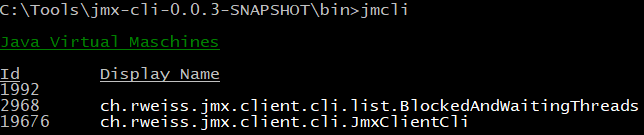
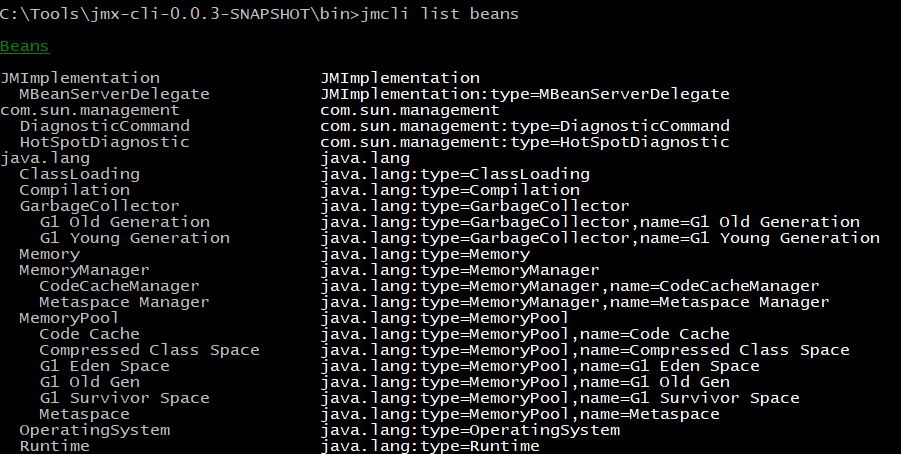
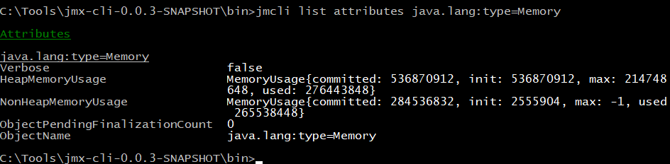
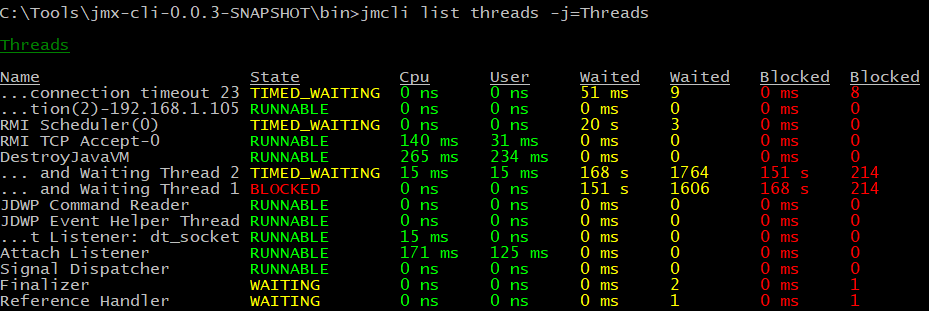
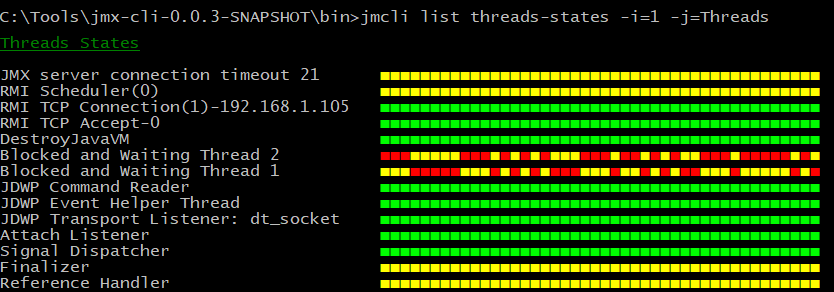
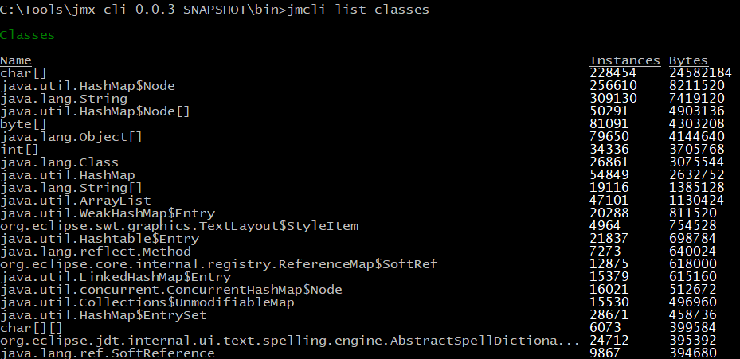
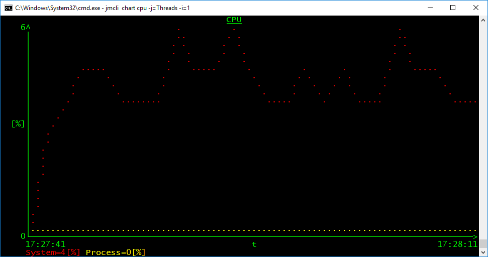
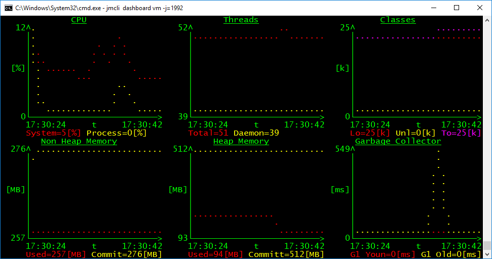

# Java Management Command Line Interface (jmcli) 

The jmcli is a command line tool that displays information about Java virtual maschines in your console.

## Download / Installation

1. Download the zip file for your platform
  * [Windows](../../releases/download/v0.1.0/jmx-cli-0.1.0-windows.zip) 
  * [Linux](../../releases/download/v0.1.0/jmx-cli-0.1.0-linux.zip)  
2. Unzip the downloaded zip file to a new installation directory 
3. Add the `bin` directory inside the installation directory to the system path
 
## Help

Use `jmcli -h` to print the help.

## Available Commands

This are the commands you can use:

| Command | Description | Example |
| ------- | ----------- | ------- |
| list vm | Lists all available java virtual maschines |  |
| list beans | Lists all available management beans |  |
| list attributes | List attributes |  |
| list threads | List all threads |  |
| list threads-states | List all threads and their states |  |
| list classes | List all loaded classes and the number of instances |  |
| info vm | Prints information about a virtual machine | |
| info bean | Prints information about managment beans | |
| info attribute | Prints information about attributes | |
| info operation | Prints information about operations | |
| set attribute | Sets the value of an attribute | |
| invoke operation | Invokes an operation | |
| chart | Draws a chart |  |
| dashboard | Draws a dashboard |  |

## Important Options

| Short Option | Long Option | Description |
| ------------ | ----------- | ----------- | 
| -h | --help | Displays the help |
| -j={jvm} | --jvm={jvm} | Process identifier or part of the main class of the virtual maschine to connect to |
| -i={interval} | --interval={interval} | Refresh interval in seconds |
| -v | --verbose | Displays detail messages |
| -V | --version | Displays version information |

## Requirements

### Operating System

The following Operating Systems are supported:
* Windows 10
* Linux

### Java

Currently only Java 8 is support to execute jmcli